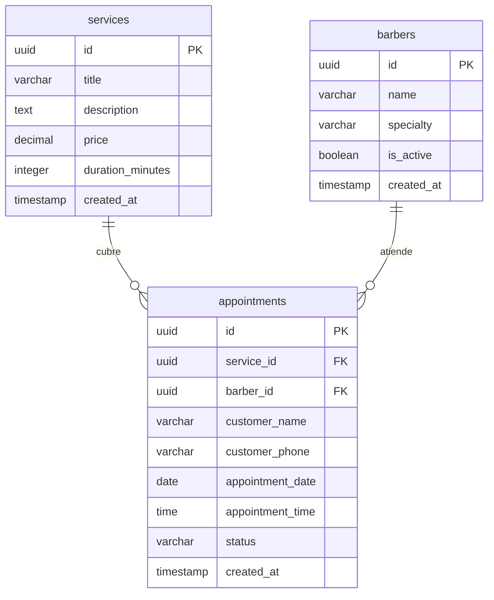

# 💈 SmartBarber

> Plataforma *mobile-first* de agendamiento y gestión de citas diseñada específicamente para barberías independientes y el contexto del mercado mexicano.

<p align="center">
  <a href="https://nextjs.org/">
    
  </a>
  <a href="https://react.dev/">
    
  </a>
  <a href="https://www.typescriptlang.org/">
    
  </a>
  <a href="https://supabase.com/">
    
  </a>
</p>

<p align="center">
  <a href="#-1-instalaci%C3%B3n-y-configuraci%C3%B3n-local">Ver Guía de Instalación</a> •
  <a href="#-2-arquitectura-y-estructura-del-proyecto">Estructura del Proyecto</a> •
  <a href="#-3-dise%C3%B1o-de-base-de-datos">Esquema de Base de Datos</a> •
  <a href="#-4-especificaci%C3%B3n-de-requerimientos-srs">Especificación SRS Completa</a>
</p>

---

## 📖 Descripción General

SmartBarber resuelve la desconexión existente entre barberos independientes y clientes en México. Las aplicaciones predominantes en el sector están diseñadas para mercados anglosajones, lo que impone barreras como soporte deficiente en español, modelos de comisiones elevados y carencia de métodos de pago adaptados a LATAM (como transferencias interbancarias directas SPEI).

Esta aplicación elimina intermediarios costosos mediante un modelo freemium, proporcionando una solución en español de origen, notificaciones automatizadas vía canales locales (WhatsApp/Push) y cobro local simplificado.

---

## 🛠️ Stack Tecnológico

El proyecto está diseñado bajo un enfoque modular, escalable y con tipado estricto en todas sus capas:

* **Frontend:** [Next.js](https://nextjs.org/) (App Router) y [React 19](https://react.dev/) para interfaces dinámicas y renderizado óptimo.
* **Backend:** Serverless Route Handlers en Next.js (API Routes) implementando autenticación y control de flujo de reservas.
* **Base de Datos & Backend-as-a-Service:** [Supabase](https://supabase.com/) (PostgreSQL relacional) para la persistencia, integridad referencial y disparadores de datos en tiempo real.
* **Estilos:** Vanilla CSS estructurado con variables globales y CSS Modules independientes para modularidad.
* **Gestión de Fechas:** [date-fns](https://datefns.org/) y [react-day-picker](https://react-day-picker.js.org/) para un control preciso de la agenda en el calendario interactivo.

---

## 📂 Arquitectura y Estructura del Proyecto

La estructura de directorios sigue los estándares de organización de proyectos en Next.js, separando las responsabilidades de persistencia de datos, lógica de negocio y presentación de componentes UI:

```text
smart-barber/
├── app/                      # Rutas de Next.js (App Router)
│   ├── admin/                # Panel de control de administración para Barberos
│   │   └── page.tsx          # Vista consolidada de la agenda diaria/semanal
│   ├── api/                  # Controladores de la API Serverless
│   │   └── booking/          
│   │       └── route.ts      # Endpoint HTTP para procesamiento de citas
│   ├── globals.css           # Estilos e identidades visuales globales de la app
│   ├── layout.tsx            # Contenedor raíz de vistas e inyección de metadatos
│   └── page.tsx              # Landing page orientada al cliente y flujo de reserva
├── components/               # Componentes UI autocontenidos y reutilizables
│   ├── BookingModal.tsx      # Modal dinámico de captura y reserva de citas
│   └── ServiceCard.tsx       # Tarjeta de servicios individuales del catálogo
├── lib/                      # Configuraciones globales y clientes de terceros
│   └── supabase.ts           # Inicialización y exportación del cliente Supabase
├── public/                   # Archivos estáticos y recursos multimedia
├── styles/                   # Módulos CSS aislados
├── types/                    # Definición de tipos globales en TypeScript
├── database.sql              # Script relacional de inicialización en PostgreSQL
├── package.json              # Registro de dependencias y scripts de ejecución
└── tsconfig.json             # Reglas del compilador y tipado de TypeScript
```

---

## 🗄️ Diseño de Base de Datos

El motor relacional utiliza **PostgreSQL** hospedado en **Supabase**, asegurando integridad mediante llaves foráneas y borrado en cascada.



### Script de Estructura (`database.sql`)

El script SQL completo incluye la habilitación de extensiones de UUID, índices de rendimiento para optimizar la velocidad de respuesta, políticas de seguridad a nivel de fila (Row Level Security) y soporte para actualizaciones en tiempo real a través de canales de Supabase:

```sql
-- Habilitar extensiones necesarias
CREATE EXTENSION IF NOT EXISTS "uuid-ossp";

-- 1. Tabla de Barberos
CREATE TABLE barbers (
    id UUID DEFAULT uuid_generate_v4() PRIMARY KEY,
    name VARCHAR(100) NOT NULL,
    specialty VARCHAR(100) NOT NULL,
    is_active BOOLEAN DEFAULT TRUE,
    created_at TIMESTAMP WITH TIME ZONE DEFAULT NOW()
);

-- 2. Tabla de Servicios
CREATE TABLE services (
    id UUID DEFAULT uuid_generate_v4() PRIMARY KEY,
    title VARCHAR(100) NOT NULL UNIQUE,
    description TEXT,
    price DECIMAL(10, 2) NOT NULL CHECK (price >= 0),
    duration_minutes INTEGER NOT NULL CHECK (duration_minutes > 0),
    created_at TIMESTAMP WITH TIME ZONE DEFAULT NOW()
);

-- 3. Tabla de Citas
CREATE TABLE appointments (
    id UUID DEFAULT uuid_generate_v4() PRIMARY KEY,
    service_id UUID REFERENCES services(id) ON DELETE CASCADE,
    barber_id UUID REFERENCES barbers(id) ON DELETE SET NULL,
    customer_name VARCHAR(150) NOT NULL,
    customer_phone VARCHAR(20) NOT NULL,
    appointment_date DATE NOT NULL,
    appointment_time TIME NOT NULL,
    status VARCHAR(20) DEFAULT 'unverified' CHECK (status IN ('unverified', 'confirmed', 'completed', 'cancelled')),
    created_at TIMESTAMP WITH TIME ZONE DEFAULT NOW()
);

-- Índices de Rendimiento (Performance Tuning)
CREATE INDEX idx_appointments_service_id ON appointments(service_id);
CREATE INDEX idx_appointments_barber_id ON appointments(barber_id);
CREATE INDEX idx_appointments_date_time ON appointments(appointment_date, appointment_time);

-- Habilitar Seguridad RLS y definir políticas...
-- (Ver script completo para políticas detalladas e inyección de semillas)
```

---

## 🚀 Instalación y Configuración Local

Sigue estos pasos para implementar y ejecutar una réplica local del entorno de desarrollo:

### 1. Clonar el repositorio y acceder
```bash
git clone https://github.com/BlueBoyDev/smart-barber.git
cd smart-barber
```

### 2. Instalar las dependencias
Asegúrate de contar con Node.js en su versión LTS instalada (v18+ recomendada) y ejecuta:
```bash
npm install
```

### 3. Configurar la base de datos
1. Inicia sesión en tu consola de [Supabase](https://supabase.com/).
2. Crea un nuevo proyecto PostgreSQL.
3. Ve a la sección **SQL Editor**, copia las sentencias contenidas en [database.sql](file:///c:/Portafolio/smart-barber/database.sql) de tu entorno local, y ejecútalas para estructurar las tablas e insertar los datos semilla iniciales.

### 4. Configuración de Variables de Entorno
Duplica el archivo `.env.example` y renómbralo a `.env.local`:
```bash
cp .env.example .env.local
```
Edita `.env.local` e introduce tus llaves de conexión de Supabase obtenidas en la configuración del proyecto (*Project Settings > API*):
```env
NEXT_PUBLIC_SUPABASE_URL=tu_supabase_url
NEXT_PUBLIC_SUPABASE_ANON_KEY=tu_supabase_anon_key
```

### 5. Iniciar el Servidor de Desarrollo
```bash
npm run dev
```
La aplicación estará disponible en [http://localhost:3000](http://localhost:3000).

---

## 🛠️ Buenas Prácticas e Ingeniería de Calidad

Este repositorio está construido bajo estrictas directrices de calidad y mantenimiento de software:

* **Tipado Estricto:** Toda estructura de datos interna, comunicación con la API e interacción con Supabase está validada mediante interfaces de **TypeScript** (`types/`), previniendo fallos en tiempo de ejecución.
* **Componentización Atómica:** Desarrollo de componentes UI aislados y desacoplados (`components/`) que simplifican el mantenimiento y las pruebas automatizadas independientes.
* **Clean Code:** Separación estricta entre la UI visual, el consumo de datos externos (`lib/`) y los controladores serverless del API (`app/api/`), optimizando la legibilidad de la arquitectura general.
* **Control de Calidad:** Verificación estática constante de errores de formato y sintaxis por medio de las directrices e integraciones de **ESLint** antes de cada fase de despliegue.

---

## 📚 Especificación de Requerimientos (SRS)

El análisis detallado del producto, el estudio de mercado comparativo, las especificaciones detalladas de cada requerimiento, las historias de usuario y la matriz de casos de prueba han sido organizados en un documento independiente de ingeniería:

👉 **[Especificación Completa de Requerimientos (SRS)](docs/srs.md)**

---

## 📄 Licencia

Este proyecto se distribuye bajo la Licencia MIT. Consulta el archivo correspondiente para obtener más detalles.

