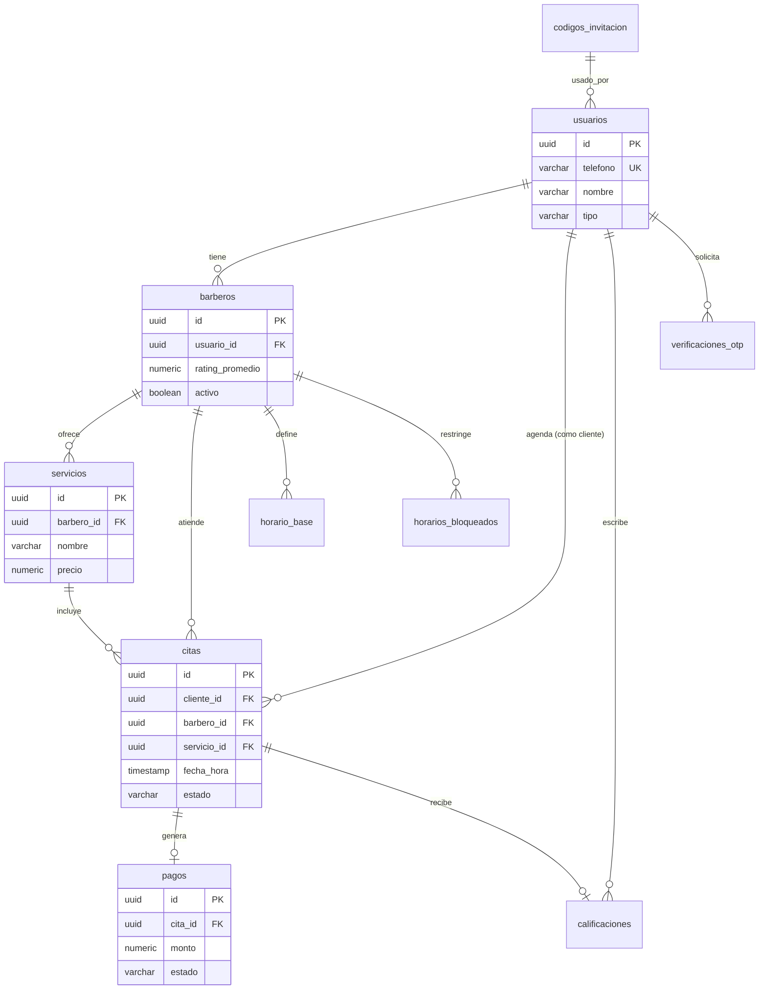

# SmartBarber

> Plataforma *mobile-first* de agendamiento y gestión de citas diseñada específicamente para barberías independientes y el contexto del mercado mexicano.

<p align="center">
  <a href="https://nextjs.org/"></a>
  <a href="https://react.dev/"></a>
  <a href="https://www.typescriptlang.org/"></a>
  <a href="https://supabase.com/"></a>
</p>

<p align="center">
  <a href="#-descripción-general">Descripción General</a> •
  <a href="#-stack-tecnológico">Stack Tecnológico</a> •
  <a href="#-arquitectura-y-estructura-del-proyecto">Estructura</a> •
  <a href="#-diseño-de-base-de-datos">Base de Datos</a> •
  <a href="#-instalación-y-configuración-local">Instalación</a> •
  <a href="#-buenas-prácticas-e-ingeniería-de-calidad">Buenas Prácticas</a>
</p>

---

## 📖 Descripción General

SmartBarber resuelve la desconexión existente entre barberos independientes y clientes en México. Las aplicaciones predominantes en el sector están diseñadas para mercados anglosajones, lo que impone barreras como soporte deficiente en español, modelos de comisiones elevados y carencia de métodos de pago adaptados a LATAM (como transferencias interbancarias directas SPEI).

Esta aplicación elimina intermediarios costosos mediante un modelo freemium, proporcionando una solución en español de origen, notificaciones automatizadas vía canales locales (WhatsApp/Push) y cobro local simplificado.

---

## 🛠️ Stack Tecnológico

El proyecto está diseñado bajo un enfoque modular, escalable y con tipado estricto en todas sus capas:

* **Frontend:** [Next.js](https://nextjs.org/) (App Router) y [React 19](https://react.dev/) para interfaces dinámicas y renderizado óptimo.
* **Backend:** Serverless Route Handlers en Next.js (API Routes) implementando autenticación y control de flujo de reservas.
* **Base de Datos & Backend-as-a-Service:** [Supabase](https://supabase.com/) (PostgreSQL relacional) para la persistencia, integridad referencial y disparadores de datos en tiempo real.
* **Estilos:** Vanilla CSS estructurado con variables globales y CSS Modules independientes para modularidad.
* **Gestión de Fechas:** [date-fns](https://datefns.org/) y [react-day-picker](https://react-day-picker.js.org/) para un control preciso de la agenda en el calendario interactivo.

---

## 📂 Arquitectura y Estructura del Proyecto

La estructura de directorios sigue los estándares de organización de proyectos en Next.js, separando las responsabilidades de persistencia de datos, lógica de negocio y presentación de componentes UI:

```text
smart-barber/
├── app/                      # Rutas de Next.js (App Router)
│   ├── admin/                # Panel de control de administración para Barberos
│   ├── api/                  # Controladores de la API Serverless
│   ├── globals.css           # Estilos e identidades visuales globales de la app
│   ├── layout.tsx            # Contenedor raíz de vistas e inyección de metadatos
│   └── page.tsx              # Landing page orientada al cliente y flujo de reserva
├── components/               # Componentes UI autocontenidos y reutilizables
├── lib/                      # Configuraciones globales y clientes de terceros
├── public/                   # Archivos estáticos y recursos multimedia
├── styles/                   # Módulos CSS aislados
├── types/                    # Definición de tipos globales en TypeScript
├── database.sql              # Script relacional de inicialización en PostgreSQL
├── package.json              # Registro de dependencias y scripts de ejecución
└── tsconfig.json             # Reglas del compilador y tipado de TypeScript
```

---

## 🗄️ Diseño de Base de Datos

El motor relacional utiliza **PostgreSQL** hospedado en **Supabase**, asegurando integridad mediante llaves foráneas.



---

## 🚀 Instalación y Configuración Local

Sigue estos pasos para implementar y ejecutar una réplica local del entorno de desarrollo:

### 1. Clonar el repositorio y acceder
```bash
git clone https://github.com/BlueBoyDev/smart-barber.git
cd smart-barber
```

### 2. Instalar las dependencias
Asegúrate de contar con Node.js en su versión LTS instalada (v18+ recomendada) y ejecuta:
```bash
npm install
```

### 3. Configurar la base de datos
1. Inicia sesión en tu consola de [Supabase](https://supabase.com/).
2. Crea un nuevo proyecto PostgreSQL.
3. Ve a la sección **SQL Editor**, copia las sentencias contenidas en `database.sql` de tu entorno local, y ejecútalas para estructurar las tablas.

### 4. Configuración de Variables de Entorno
Duplica el archivo `.env.example` y renómbralo a `.env.local`:
```bash
cp .env.example .env.local
```
Edita `.env.local` e introduce tus llaves de conexión de Supabase:
```env
NEXT_PUBLIC_SUPABASE_URL=tu_supabase_url
NEXT_PUBLIC_SUPABASE_ANON_KEY=tu_supabase_anon_key
```

### 5. Iniciar el Servidor de Desarrollo
```bash
npm run dev
```
La aplicación estará disponible en [http://localhost:3000](http://localhost:3000).

---

## 🛠️ Buenas Prácticas e Ingeniería de Calidad

Este repositorio está construido bajo estrictas directrices de calidad y mantenimiento de software:

* **Tipado Estricto:** Toda estructura de datos interna, comunicación con la API e interacción con Supabase está validada mediante interfaces de **TypeScript** (`types/`), previniendo fallos en tiempo de ejecución.
* **Componentización Atómica:** Desarrollo de componentes UI aislados y desacoplados (`components/`) que simplifican el mantenimiento y las pruebas automatizadas independientes.
* **Clean Code:** Separación estricta entre la UI visual, el consumo de datos externos (`lib/`) y los controladores serverless del API (`app/api/`), optimizando la legibilidad de la arquitectura general.

---

## 📄 Licencia

Este proyecto se distribuye bajo la Licencia MIT. Consulta el archivo correspondiente para obtener más detalles.
